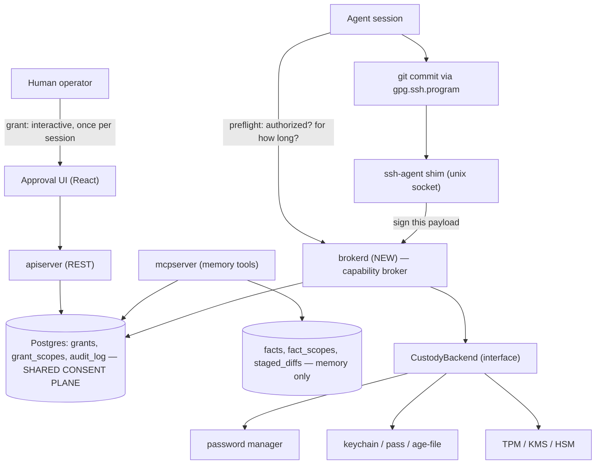

# Agent Capability Broker

Design document for the Agent Capability Broker workstream — extending chuvar's consent
model from **facts** to **capabilities**, starting with git commit signing. Migrated from
the project's private design log on 2026-08-08 as part of preparing chuvar for open source;
the decision dates below are original to when each decision was made, not to this migration.

> **Status: design-stage.** Problem framing is complete; the architecture below is a DRAFT
> pending confirmation (see Open Questions). No capability grant can be created yet — there
> is no REST or MCP surface for one. Capability grants are gated on two things landing first:
>
> 1. **The zero-ambient-authority floor** (tracker tickets E1, E2, E6). E1 and E6 are done;
>    E2 is in progress. A related but separate ticket, E3 — removing `mcpserver`'s residual
>    direct database credential — is outstanding and tracked independently (see the trust
>    boundary decision below).
> 2. **A phishing-resistant reviewer factor** (Passkeys/WebAuthn) on the grant-approval path.
>    Not started. Today that path is protected by a device-local TOTP second factor, which is
>    an explicit interim stopgap, not the target state.
>
> Until both land, this document describes target design and settled decisions, not shipped
> enforcement.

---

## Meta problem statement

Chuvar already solves *"an agent needs a fact the human owns, while the human is absent"* —
scoped, time-boxed, revocable, audited grants across a consent boundary, with staged approval
for anything that mutates.

This workstream is the same problem over a different noun: an agent needs a **capability**
the human owns — sign this object, write to this path, merge this PR, reach this host —
while the human is absent.

That capability is currently held by credential managers built on the assumption that **the
principal is a present human**. Every property that makes a password manager correct for a
human at a keyboard is wrong for an unattended agent: unlock is coupled to screen presence;
the grant is possession-shaped (whole vault, indefinite, all operations); there is no
principal identity for the agent distinct from the human's; failure is designed for someone
who can read a dialog and retry.

The result is a forced choice between availability and containment — and, absent a real
capability model, a degradation path that is strictly worse than the control it replaces.

### The core insight: the bypass ratchet

**The only lever available to an unattended agent, when a control blocks it, is some form of
bypass — and a bypass has none of the properties the control it replaced.**

The generic failure shape: a one-off exception is granted once, under time pressure, to get
past a blocked operation. Nothing about that exception is scoped, time-boxed, or audited —
it's a flag flipped, a check disabled. Once it exists, it's the path of least resistance the
next time the same operation runs, and the time after that. **Each use ratchets the
baseline** — a control that was supposed to be the exception quietly becomes the default,
and the artifact it was meant to gate (an unsigned commit, an unreviewed merge) is now
produced routinely rather than deliberately. Nobody re-decides to keep bypassing; the system
simply never asks again.

A second, related failure shape: authority left ambiently reachable — a token or credential
sitting somewhere a process can just pick up, with no scoping and no expiry — pushes the
actual authorization decision into whatever happens to gate its *use*. If that gate is a
comment in a prompt file or a paragraph of operating instructions, then a prompt file is
functioning as an authorization policy. **Policy that lives in instructions rather than
enforcement fails exactly when the agent is confused, misled, or injected** — which is
precisely the situation it's relied on to hold up under.

Neither failure is a bug in a specific vendor's product. The same category of session can
exhibit both directions of failure at once, on different credentials:

| Credential class | Posture | Result |
|---|---|---|
| Commit signing key (password-manager-backed) | Containment ≫ availability | Blocked finished, validated work at the publication boundary |
| A broad-scope API token | Availability ≫ containment | Ambient, unscoped, permanent — usable for any operation the token's scope allowed, governed only by whatever instructions happened to be nearby |

Same missing abstraction, opposite directions. The empty category is **delegated authority
for a non-human principal** — not credential storage, which existing tools already do well.

### What this converges on

1. **The secret is never needed — the operation is.** Nobody actually wants possession of
   the key; they want the signature, the merge, the write. Chasing "give the agent the key"
   as a fix is solving the wrong layer.
2. **Failure tends to land at the publication boundary**, not during implementation — after
   format, vet, test, and manual verification have all already passed. The cost of a blocked
   control isn't the block itself, it's *when* it bites relative to sunk work.
3. **Availability isn't queryable.** "Can I sign in this repo right now, and for how long?"
   is often unanswerable in advance — which is close to the single highest-leverage fix
   available.
4. **Failure is undifferentiated.** A single opaque error string collapses *locked* /
   *contended* / *unreachable* / *denied* into one signal, so every distinct failure gets the
   same (usually wrong) response.
5. **The grant is over-scoped.** One unlock covering both "sign commits" and "authenticate to
   arbitrary hosts" bundles two operations with different lifetimes and different blast radii
   into one lever.
6. **Contention can present as an authorization failure.** Two concurrent sessions sharing one
   single-holder credential, with no queue and no "held elsewhere" signal, looks identical to
   being denied.
7. **The abstraction is about authority, not keys.** At least one relevant failure mode
   involves no credential at all — filesystem write authority to a path — same shape, no
   secret in sight.

---

## Requirements

- **Survives operator absence** — screen lock, closed lid, hours.
- **Scoped** — this repository, this operation class, this session.
- **Time-bounded** — explicit TTL, not "until reboot."
- **Revocable mid-session** without rotating the underlying key.
- **Auditable** — which agent signed what, when, under whose grant.
- **Non-interactive at use time, interactive only at grant time.**
- **Introspectable before use** — an agent can ask "do I have authority, and for how long?"
  *before* starting a long-running operation.
- **Renewable and revocable without a terminal** — renewal cost is what sets viable TTL
  length.
- **Never blind-signs** — the broker constrains what it will put a signature over.
- **Degradation is reported, not authorized** — see below.

### Degradation: policy at calm time, exception records at failure time

**Superseded position (2026-07-27, same day):** an earlier draft proposed a bypass — e.g. a
`git.sign.bypass` grant — as a first-class grant with a TTL, audit record, and revocation:
the bypass given the same properties as the control it replaces. That is rejected. Recorded
here because the reasoning constrains the replacement.

It fails on three counts:

1. **A broker-issued bypass cannot cover broker unavailability** — the mechanism is absent
   in exactly the scenario that motivates it. This alone is close to fatal.
2. **It is an attractive nuisance.** An agent under pressure requests it; a human under
   pressure approves it. It converts an emergency into a supported feature.
3. **It launders the signal.** Today an unsigned commit means something broke and someone
   should look. As a grant, unsigned commits read as *intentional and authorized* and nobody
   investigates — a net loss in observability, the opposite of the intent.

The replacement keeps the anti-ratchet property without the standing lever:

**Signing requirement is repo policy, not a runtime grant.** `required` / `preferred` /
`off`, set by a human at configuration time. The distinction that matters is not the
mechanism but *who decides and when*: an agent can request a grant; an agent cannot change
policy. That moves the decision from "under pressure, mid-session, by whoever is tired" to
"deliberately, when calm." Under `required` there is no bypass — the agent blocks and the
work waits.

**Proceeding unsigned emits an exception record, not an authorization.** *"At T, agent X
could not obtain a signature for commit C because `BACKEND_UNREACHABLE`; proceeded
unsigned."* This can be written locally and reconciled later, so it **works when the broker
is down** — the thing a grant structurally cannot do. It makes unsigned commits
self-reporting rather than silently normal.

**Preflight makes the scenario rare.** Bypass tends to get reached for when blocking is
catastrophic — hours of validated work stranded at the publication boundary. With a preflight
check the agent never *arrives* at that boundary without authority. The remaining residue is
a failure to report, not a decision to authorize.

---

## Architecture (confirmed 2026-08-09 — see decision log)

Shared consent plane, separate execution plane. One `grants` / `grant_scopes` / `audit_log`
schema and one approval UI; a distinct broker process that never touches the facts path.

Rationale: memory retrieval is read-heavy, latency-tolerant, and failure-soft. Signing is a
synchronous blocking call on a hot path where a two-second stall aborts a commit. Same
consent model, different availability requirements — so: same tables, different binary.

**Invariants the diagram encodes:**

- `brokerd` never reads `facts`. `mcpserver` never holds key material. The only shared
  surface is the grant and audit tables.
- The ssh-agent shim means git needs no modification beyond pointing at a socket.
- Preflight is a separate, cheap call — not a side effect of attempting to sign.

### The broker must not blind-sign

**`brokerd` must not expose a general ssh-agent sign operation.** As originally drawn, a
plain shim violates success criterion 7 by construction.

SSH signatures use SSHSIG framing with a namespace field: git signs under namespace `git`,
while SSH host authentication uses an entirely different structure. That separation is what
makes "a signing grant does not confer host access" achievable at all. But the ssh-agent
protocol's `SIGN_REQUEST` will sign **arbitrary blobs** — including a host authentication
challenge. A generic agent socket therefore hands any holder of a signing-only grant the
ability to authenticate to arbitrary hosts.

Required instead: the broker parses the payload, verifies it is a well-formed git commit
object, checks the committer identity against the grant, and emits SSHSIG in the `git`
namespace only. Anything else is refused.

Secondary benefit: the audit log can record *what* was signed, not merely that something was.

> Origin: this constraint came out of evaluating (and rejecting) a proposed JIT nonce
> scheme — broker issues a nonce, requester embeds it in the payload. The nonce itself
> doesn't survive scrutiny: an attacker who can reach the socket to sign can equally reach it
> to fetch a nonce, so it defends against replay rather than the actual threat, and git
> leaves no free field for it that wouldn't leak into public history. But the instinct behind
> it — *the broker should not blind-sign* — was correct, and produced the constraint above
> instead.

---

## Custody model

**Decision (2026-07-27):** dedicated agent identity, with a pluggable custody backend. Key
material lives encrypted at rest in a password manager or keychain; at grant time
(interactive, human present) the broker fetches and decrypts it and holds the plaintext **in
process memory for the grant duration only**.

Why this shape:

- It moves the human-presence requirement to exactly one point — grant time — which is
  precisely where interactivity belongs.
- Nothing sits unencrypted at rest.
- **Revocation becomes destruction, not decision.** Grant expiry zeroizes the material rather
  than flipping a boolean the broker consults. That is a materially stronger revocation story
  than a TTL check.
- The pluggable backend is what keeps the delegation-layer-vs-vault question open (see Open
  Questions).

### Known risks in this model

| Risk | Mitigation |
|---|---|
| The Go runtime may copy heap-allocated key bytes during GC; a `[]byte` cannot be reliably zeroized | Allocate outside the Go heap (`mmap`); evaluate a memory-guarding library rather than hand-rolling |
| Decrypted key can be paged to swap and persist past process death | `mlock` the region |
| Core dumps and `ptrace` expose the key to any same-user process | `PR_SET_DUMPABLE 0`. This bounds exposure *in time* rather than isolating it — an honest limitation, not a full answer |
| Grant *renewal* reintroduces the custody backend's availability dependency | Renewal requestable early (~50% TTL remaining) with pushed warnings, so failure surfaces with slack rather than at a hard boundary |
| A dedicated key nobody has vouched for produces "Unverified" on GitHub | Register as an account signing key and add to `allowed_signers` — a hard prerequisite for the primary success criterion |

### The risk that actually matters

Once the process holds the key for an hour, **anything that can talk to its socket can
sign.** Socket authorization matters more than memory hygiene: *who is the calling principal,
how do we know, and what happens if they lie?*

This is the same question chuvar's own review discipline mandates for every access-control
boundary, and a subject-spoofing gap has already shipped once in this codebase by not asking
it early enough. A perfectly-`mlock`ed key behind an unauthenticated Unix socket is worse
than a sloppily-held key behind a strong one. **Design effort belongs here.**

---

## Grant control plane

Grants are managed from local and hosted CLI, desktop and mobile clients — the same approval
plane that already exists for memory grants, not new surface. Renewal and revocation
therefore do not require the operator at a terminal.

**This is load-bearing for the security model, not a convenience.** Renewal cost sets TTL
length. If renewing means walking to a desk and unlocking something, long TTLs get set to
avoid the friction — which is bad containment, and reproduces the original problem in new
clothes. If renewal is a phone tap, **short grants become viable**. Cheap renewal is what
lets the grant model be tight rather than loose.

It is also the only plausible route to success criterion 4 ("revoking stops signing within
seconds") — that is a mobile kill switch, and nothing else in the design provides one.

And it is the *push* counterpart to preflight's *pull*: "38 minutes of signing authority
left, extend?" arriving on a phone is the same requirement as an agent asking before it
starts a long-running operation.

### Constraint: the approval path must not be agent-reachable

If a generic agent can drive the approval client, the entire model collapses — the requester
approves its own request and we are back to an ambient, unscoped credential. Classic confused
deputy.

The constraint is statable now even though the work is deferred: **approval must never be
reachable from the same authority the agent holds.** The approving device is enrolled out of
band, its credential never enters any agent context, and approval requires a device-local
factor an agent cannot supply. Same reason two-factor authentication works.

Allowing *specific, authorised, limited* agents to hold approval authority is a plausible
later refinement, but it is a separate problem and should not be designed for now. The
near-term requirement is only that the architecture not foreclose it.

---

## Typed failure taxonomy

Replacing one undifferentiated error string. Every response carries the authorized fallback
where one exists, so the agent does not have to invent a degradation path.

| Code | Meaning | Correct agent response |
|---|---|---|
| `OK` | Signature returned | Proceed |
| `NO_GRANT` | Never granted, expired, or revoked | Request grant; consult the repo's signing policy (under `preferred`, proceeding unsigned emits an exception record) |
| `SCOPE_DENIED` | Grant exists but does not cover this scope | Do not retry; escalate |
| `LOCKED` | Custody backend needs human unlock | Request renewal; do not retry blindly |
| `CONTENDED` | Held by another session; includes `retry_after` | Bounded wait |
| `BACKEND_UNREACHABLE` | Custody backend down | Escalate; distinct from `LOCKED` |
| `RATE_LIMITED` | Anomaly tripwire fired | Stop and surface — this is a signal, not backpressure |

---

## Success criteria

1. An agent signs N commits across a multi-hour session with the operator's screen locked
   throughout. Verified by `git log --format=%G?` returning `G`.
2. The operator grants once, interactively, at session start.
3. Impending expiry is queryable *before* it bites, cheaply enough to check before every
   commit.
4. Revoking a grant stops signing within seconds, and afterwards the agent holds nothing
   that still works.
5. Each signature is attributable to (agent, session, grant) in the audit log.
6. Failure modes are distinguishable to the caller — see taxonomy above.
7. A signing grant does not confer SSH authentication to arbitrary hosts. Verified by
   attempting host auth against a real host with a signing-only grant and being refused,
   **and** by confirming the broker rejects a non-commit-object payload outright.
8. Under repo policy `required`, no runtime mechanism exists to proceed unsigned. Under
   `preferred`, proceeding unsigned emits a machine-checkable exception record that is
   produced even when the broker is unreachable, and does not depend on the agent choosing to
   narrate it.
9. A grant can be extended or revoked without the operator being at a terminal, and the
   approval path is not reachable using any authority the requesting agent holds.
10. Key material is absent from the calling session's process memory and filesystem
    throughout.

---

## Non-goals

- Possession of, or direct session access to, private key material.
- Bypassing human authority over what gets signed or merged. The problem is that authority
  was *unavailable*, not that it was inconvenient.
- Diagnosing the root cause of any specific credential-manager failure mode. The broker
  should fail legibly regardless of which layer broke.
- Fixing session-topology bugs in credential-agent environment inheritance. The broker should
  be robust in their presence, not paper over them.
- Automated key provisioning or minting new identities without human action.
- Solving general API-token scoping in the same mechanism. Real and noted, but a distinct
  problem — bundling would muddy both.

---

## Open questions

1. **Architecture confirmation.** ~~Does the shared-consent-plane / separate-execution-plane
   split above hold up, or does the broker want its own store entirely?~~ **Resolved
   2026-08-09** — draft confirmed; see decision log.
2. **Identity separation.** ~~If the agent key is registered to the same source-control account
   as the human operator, commits still attribute to the human but with a distinguishable
   key.~~ **Resolved 2026-08-09** — identity is grant content, not broker structure; all
   three shapes are supported configurations. See decision log.
3. **SaaS custody.** The in-process-memory model is fine on a single-tenant deployment; one
   process holding many tenants' keys is a much harder story. TPM/KMS is likely not a "later
   upgrade" but specifically **the SaaS deployment's custody backend**, with keychain for
   self-hosted. Same interface, different implementation.
4. **Scope vocabulary.** ~~Reuse the dotted-string convention verbatim?~~ **Resolved
   2026-08-09** — dotted operation plus optional colon-delimited target; see decision log.
5. **Count-bounded grants.** Proposed position: TTL is the control, count is an anomaly
   tripwire. Hundreds of signatures in a minute is a signal; a dozen over a night is normal.
6. **Expiry mid-operation.** Proposed position: fail closed, but make it never bite via
   queryable and pushed expiry. A grace period would reintroduce silent degradation.

---

## Decision log

Append-only. Entries are superseded in place by later entries, never edited or removed.

### 2026-07-27 — Capabilities are the same grant model as facts

The consent primitive (`subject`, `scopes`, TTL, revocation, audit) generalises from memory
to capabilities. Reuse the model; do not build a second one.

### 2026-07-27 — Dedicated agent identity, not the operator's personal key

Independently justified by provenance: agent-authored commits become distinguishable from
hand-written ones, which is a win even if availability were perfect. Not a concession made to
work around a specific credential manager's limitations.

### 2026-07-27 — Custody backend is a pluggable interface

Three known implementations were already identified (password manager, OS keychain,
hardware/KMS), which satisfies the bar for introducing an interface rather than a concrete
type — the second caller is decided, not speculative.

### 2026-07-27 — Delegation layer and vault are configurations, not products

With a pluggable custody backend, "delegation layer above an existing credential manager" and
"vault for agent credentials" are two configurations of one system. Architecturally
symmetric; commercially they are not — the vault configuration means owning key-at-rest
encryption, rotation, backup/recovery and breach response. Design for both, ship the vault
configuration only when a real need names it.

### 2026-07-27 — Rejected: bypass as a first-class grant

An earlier draft proposed a bypass grant with a TTL, audit record and revocation. Rejected on
operator challenge. Decisive objection: a broker-issued bypass cannot cover broker
unavailability, which is the scenario that motivates it. Compounding objections: it is an
attractive nuisance under time pressure, and it launders unsigned commits from "something
broke, investigate" into "intentional and authorized," which is a net loss in observability.

### 2026-07-27 — Signing requirement is repo policy; failure emits an exception record

Replaces the rejected bypass grant. Policy (`required` / `preferred` / `off`) is set by a
human at configuration time and is not agent-requestable — the decision moves from
mid-session pressure to deliberate calm-time configuration. When the broker is unavailable
under `preferred`, the agent emits a locally-written, later-reconciled exception record. This
is an audit artifact rather than an authorization, and unlike a grant it is producible while
the broker is down.

### 2026-07-27 — The broker never blind-signs; no generic ssh-agent socket

`brokerd` must parse the payload, verify a well-formed git commit object, check committer
identity against the grant, and emit SSHSIG in the `git` namespace only. A generic ssh-agent
`SIGN_REQUEST` will sign arbitrary blobs including SSH host authentication challenges, which
would let a signing-only grant confer host access and break success criterion 7 by
construction. Surfaced while evaluating (and rejecting) a proposed JIT nonce.

### 2026-07-27 — Grant control plane is a security requirement, not a convenience

CLI, desktop and mobile clients for grant renewal and revocation, reusing the existing
memory-grant approval plane. Rationale: renewal cost determines viable TTL length, so cheap
out-of-band renewal is what makes short grants livable instead of forcing long ones. Also the
only route to second-scale revocation. Hard constraint: the approval path must not be
reachable from any authority the requesting agent holds, or the requester approves its own
request.

### 2026-07-30 — The shared grants schema now has a kind discriminator, implemented

The 2026-07-27 "capabilities are the same grant model as facts" decision above is now code,
not just direction: [PR #24](https://github.com/abradner/chuvar/pull/24) added
`kind TEXT NOT NULL DEFAULT 'memory' CHECK (kind IN ('memory', 'capability'))` to both
`grants` and `grant_requests`, with `depth` (`summary`/`facts`/`full`) made nullable and
paired to `kind = 'memory'` via a DB-level CHECK constraint (`grants_kind_depth_pairing`) —
a capability grant has no depth concept, enforced at the schema level, not just in Go.
Additive migration, existing rows unaffected. No REST/MCP surface for *creating* a capability
grant yet — that remains this workstream's own design work — but the shared table now has a
place to put one when `brokerd` exists.

Also now implemented in the shared schema, directly answering requirements from this page's
own "Grant control plane" section: **renewal**
([PR #27](https://github.com/abradner/chuvar/pull/27) — `store.RenewGrant`, TOTP-gated
`POST /api/grants/{id}/renew`, required TTL — renewing into "no expiry" isn't allowed) and a
**pushed expiry warning** (`grant_expiring` on the existing SSE stream, `cmd/pushbridge`
notifies on it). This is memory-grant-only today (no capability grants exist to renew yet),
but it's the same `grants` row shape and the same renewal/revocation control plane this
document specifies as load-bearing for the broker's own security model, not a convenience —
worth reusing rather than re-deriving when capability grants land.

Separately, [PR #23](https://github.com/abradner/chuvar/pull/23) landed a device-local TOTP
second factor as an interim stopgap on `approveGrantRequest`/`createGrant`/
`approveStagedDiff`/`renewGrant` — this explicitly does **not** close the Passkeys/WebAuthn
reviewer-auth ticket that this document's "approval path must not be agent-reachable"
constraint ultimately depends on.

### 2026-08-01 — Trust boundary stated: the process boundary, rooted in a human-present unlock

Resolves the "state the threat model" ticket. **The enforcement boundary is the process
boundary of chuvar's services, rooted in a human-present unlock ceremony.** The API is the
sole legitimate control surface; no root-of-trust authority (DB credentials, key material,
reviewer factors) is ambiently reachable from agent context. The database is *inside* the
boundary — reaching it directly is by definition attack-shaped, not a supported path.

This entry resolves the central open question of a related, evergreen enforcement-tracking
workstream: *what is the trust boundary, and is the API actually on it?* In chuvar's default
deployment, both the REST API and Postgres bind loopback-only on the same host, so any client
able to reach the API can, in principle, also reach the database directly and bypass every
API-layer control. A device-local second factor on the approval path constrains a stolen
bearer token used remotely, or an agent sandboxed away from the database — but it does not by
itself put the database outside the boundary. This decision is what puts it there: the
process boundary, not the API surface alone, and not an OS-user split.

**Adversary.** Locally: an instruction-following agent (confused, injected, or
over-diligent) running as the operator's own OS user, plus commodity exfiltration malware
scraping the disk — in scope for at-rest protection specifically, because chuvar's
centralisation makes it a clean target. Cloud: a sophisticated targeted attack — the harder
version this foundation must not preclude.

**The load-bearing distinction:**

- **Ambient reach** — authority exercisable through legitimate, discoverable interfaces (a
  readable env var, a checked-in password, a database connection away). What a
  well-behaved-but-misled agent will actually use. **Must be zero.**
- **Attack-shaped actions** — reaching into a database container's runtime, reading raw data
  files off disk, `ptrace`-ing a daemon, scraping process memory. Distinguishable *as*
  attacks: not spontaneously generated by a well-behaved agent, refusable by an aligned one,
  tripwire-able. Detected locally; their at-rest payoff removed by sealing (see next entry);
  structurally closed in cloud mode, which still carries its own tripwires.

**Tripwires are fail-closed**: detection yields an outage, not a log warning — zeroize
data-keys, seal the vault, halt, require human re-unlock. Consistent with "revocation becomes
destruction."

**Considered and rejected: OS-user separation.** Wrong tool on macOS, policy-fragile on
Linux, and hollow under Docker — the container-management group is root-equivalent, and
container-exec access to the Postgres container yields passwordless database access anyway.
Also rejected: credential custody as sufficient on its own — Postgres plaintext lives on disk
under the same user, hence the sealed-at-rest commitment below.

**Custody: one mechanism, not two.** Bootstrap and sealing secrets live in the same
CustodyBackend already specified above (password manager → keychain → TPM/KMS); the DB
credential and the vault master key are its first customers. Full envelope hierarchy: data
encrypted by a data-encryption key (DEK); the DEK is wrapped independently once per
authentication factor (master password, cold-stored recovery phrase minted at seal time,
future hardware/phone factor). The master password is an *authentication factor*, never the
encrypting key — rotating a factor rewraps the DEK without re-encrypting data. Wrapped DEKs
may live in the database; unwrapping material never does. Crypto is app-layer in Go, **not**
database-native crypto functions — keys must not transit SQL, logs, or query-activity views.

**Accepted costs, explicit:** (1) a service restart requires a human — the grant model's
"interactive at grant time only" posture applied to the service itself, mitigated by the same
control-plane client renewal already needs; (2) loss of ALL DEK wrappings means loss of the
vault — mitigated by the cold-stored recovery phrase; backups become ciphertext by default;
(3) runtime memory scraping while unlocked is the stated residual risk — mitigated cheaply
(memory-guarding enclaves for keys, `mlock` + `PR_SET_DUMPABLE 0` for the working set) and
accepted beyond that. Chuvar practises good memory hygiene but **is not a hardened store**;
FIPS-style certification is an explicit non-goal.

**Consequences:** `mcpserver` loses its direct database credential and migration authority
(today it holds both, inside the agent's own process tree, with the calling subject
self-declared by whoever spawns it) — the path is a thin stdio shim proxying to the API, then
a full API client authenticated with an agent-class token. That forces creation of an **agent
principal**, which is this workstream's own noun — broker work, not an unrelated tax.

**Interim state: boundary stated, not yet enforced.** Capability grants remain blocked until
the zero-ambient-authority floor lands (database password rotation with custody-held
credentials; the direct database credential out of agent reach; reviewer-factor secrets
sealed) — the same posture already flagged for the TOTP/WebAuthn interim above. Enforcement
tickets for closing this gap live in the sibling enforcement-boundary workstream, alongside
other known gaps that outlive the project that discovered them.

### 2026-08-01 — Sealed vault committed: ciphertext at rest, local AND cloud

Chuvar asks users to centralise and organise exactly what a thief wants; centralisation
obliges an at-rest posture better than the scattered status quo it replaces. Cloud will face
the sophisticated version of this attack, so the foundation is laid once, now.

Two findings collapsed the middle option ("encrypt fact text, leave vectors plaintext"): (1)
embeddings of short atomic facts are near-invertible to content (a known family of embedding-
inversion techniques; chuvar facts are the worst case — short, self-contained, embedded by a
known open model an attacker can train against); (2) the full-text search column is a
generated column derived from the plaintext content, so encrypting text breaks SQL lexical
search anyway and already forces the retrieval rework. The real choice was plaintext vs.
sealed; sealed wins.

**Design:** fact content, embeddings, and staged diffs are ciphertext at rest under the DEK.
The retrieval engine (flat vector scan + in-process lexical index + reciprocal-rank fusion)
moves into service memory behind the unlock; Postgres remains the single transactional source
of truth, with the consent plane (grants, scopes, audit) staying plaintext because it must
remain SQL-enforceable. The scope-filter-before-ranking invariant — a security property, not
a performance detail — is restated for the in-memory path: filter the candidate set by
granted scopes *before* scoring. Whether audit rows embed fact snippets is still to be
verified during design.

**Feasibility, verified on the actual target host** (a low-power ARM single-board host, 8GB
RAM, 4 performance cores with crypto extensions; 384-dimension vectors): a flat in-memory scan
is single-digit milliseconds up to roughly 100k facts (~154MB); unlock decrypt-and-load is
seconds. No approximate-nearest-neighbour index rebuild is needed at personal scale.

**Timing:** the embedder is still a stub — no plaintext-vector debt exists yet. Sealed-vault
design is sequenced after the zero-ambient floor and **before the real embedder ships**, so
the retrieval engine is built in the right place the first time. It gates the embedder, not
the broker.

### 2026-08-09 — Architecture confirmed: shared consent plane, separate execution plane

The draft above is now decided, not draft (issue #80). Grounds checked against the real
system rather than re-argued: the `kind` discriminator (PR #24), grant renewal (PR #27), and
the `grant_expiring` push already exist on the shared plane, so a separate broker store would
re-derive the approval UI, renewal, revocation, and audit for zero gain. The availability
concern that motivated the question dissolves under the custody model already decided:
`brokerd` holds decrypted key material and the grant's parameters in process memory for the
grant duration, so Postgres is never on the hot signing path — the sign call consults only
in-process state. The database is touched at grant time, renewal, and revocation-watch
(mechanism chosen at build time: `LISTEN/NOTIFY` or the existing SSE stream; whichever is
chosen must keep success criterion 4's seconds-scale revocation).

### 2026-08-09 — Scope grammar: dotted operation, optional colon-delimited target

Resolves open question 4 (issue #75). A capability scope is
`<dotted-operation>[:<target>]` — e.g. `git.sign:github.com/abradner/chuvar`. The operation
part keeps the existing grammar and `Covers` segment-boundary semantics unchanged; the target
part's grammar is defined per operation class, and memory scopes (no `:`) are untouched.
**Exact-match targets only to start** — no globs, no path patterns, until a real need names
one; the `fs.write:~/code/worktrees/**` example above is aspirational vocabulary, not
committed grammar. Same `TEXT` column, no schema change, "don't hardcode the taxonomy"
still holds. Implementation: extend `scope.Validate`/`Covers` (splits on the first `:`).

### 2026-08-09 — Agent identity is grant content, not broker structure

Resolves open question 2 (issue #76). The broker does not bake in one identity shape; the
grant names the (committer email, signing key) pair it authorizes, and the payload check
enforces whatever the human configured. Three supported configurations, chosen per use case:

1. **Operator account, dedicated key only** — commits attribute to the operator; provenance
   is in the key fingerprint (`%GK`), invisible in default tooling but present.
2. **Operator account, dedicated key + distinct committer email alias** — attribution stays
   with the operator's account; agent-authored commits are distinguishable in plain `git log`
   as well as by key.
3. **Separate machine account** — maximum visible separation, at the cost of the account's
   own credential custody and DCO/CLA complications (a Developer Certificate of Origin
   sign-off is a human's assertion of the right to contribute; a machine account muddies who
   is asserting it).

Chuvar's own default: configuration 2 (proposed; confirm at provisioning time, issue #78).

### 2026-08-09 — Signing policy lives broker-side, in the consent plane

Resolves the policy-home half of issue #72. The `required` / `preferred` / `off` policy is a
per-repository row in the consent-plane database, set by a human through the control plane.
**A checked-in policy file is rejected as enforcement**: it is agent-writable by
construction — an agent with worktree write access could flip `required` to `off`, which is
the bypass ratchet in file form and violates "an agent can request a grant; an agent cannot
change policy." An advisory copy in-repo may exist later for preflight UX only, subject to
the deletion test (removing it changes politeness, never possibility).

Exception records (the `preferred`-mode degradation artifact): the signing shim writes a
local append-only JSONL record at failure time — which works while the broker is down, the
property a grant structurally cannot have — and records are reconciled into `audit_log` on
next broker contact.

### 2026-08-09 — Capability scope `Covers` is fail-closed on target; untargeted capability scopes are rejected at grant creation

Two independent implementations of the 2026-08-09 "Scope grammar" decision above disagreed on
exactly the case that decision left implicit: what does an untargeted grant (`git.sign`, no
`:target`) authorize once *some* scopes in the system carry targets? One read it as "covers any
target" (fail open); the other as "covers nothing that has a target" (fail closed). Both passed
their own tests, because neither had a test for the case where they diverged. Resolved by the
operator, reconciling the two:

**`Covers` is fail-closed on target presence.** Whether the granted scope has a target must
match whether the requested scope has one — `gHasTarget != rHasTarget` is an unconditional
`false`. An untargeted grant does **not** cover a targeted request (no silent all-targets
grant hiding behind a bare operation name), and symmetrically a targeted grant does not cover
an untargeted request (there is no target on the request to compare against "the identical
target"). When both are targeted, the targets must be byte-for-byte identical — no prefix,
glob, or case-insensitive matching, per the existing "exact-match targets only" rule. When
neither has a target, this reduces exactly to the pre-existing dotted-ancestor `opCovers`
check with no target logic in the path at all.

**An untargeted capability scope is rejected at validation, not interpreted at `Covers`
time.** Given fail-closed `Covers`, a capability grant with no target could never authorize
anything a real capability operation actually requests (every capability operation this doc
names — `git.sign:<repo>`, the `fs.write` example — has a natural target) — it would be a
dead grant at best. Rather than let that ambiguous, functionally-inert state exist and decide
ad hoc what it "means," `scope.ValidateCapability` refuses it outright: a capability-kind
scope with no `:`-delimited target is a validation error, full stop. This is enforced today at
every place a capability-kind grant's scopes are persisted or read back —
`store.CreateGrant`, `store.RequestGrant`, and `store.ApproveGrantRequest` (the last as
defense-in-depth: `grant_requests.requested_scopes` is plain `TEXT[]` with no format CHECK
constraint, so a row inserted directly — a fixture, an operator's psql, a future bulk-import
path — must still be refused loudly at approval, not silently approved into an inert grant)
— and is the function the future capability-grant creation surface (gated, issue #96) must
also call.

**The fail-open alternative was rejected.** Interpreting a bare `git.sign` as "sign for any
repository" would have made the grant strictly more powerful than any grant a human could
have intended to approve for a single named repository — exactly the over-scoped-grant failure
mode this workstream exists to close ("What this converges on," point 5, above), reintroduced
at the target layer the moment targets existed at all. Fail-closed `Covers` plus
reject-at-creation is the "one chokepoint per property" reading of the same principle: rather
than two functions (`Covers` and some future creation check) each partially encoding "what is
a valid capability grant," the ambiguous state is unrepresentable before `Covers` ever runs.

**Memory scopes are unaffected.** `scope.Validate` (the grammar check every memory scope goes
through today, in `internal/api` and `internal/mcptools`) does not require a target and is
untouched — memory scopes never carry one, and `validateCapabilityScopes` (the `store`-package
wiring above) is a no-op for `kind = memory`, unchanged from main. `TestScope_Covers` and the
new capability-kind store tests both pin this down as an explicit regression case, not an
assumption.
